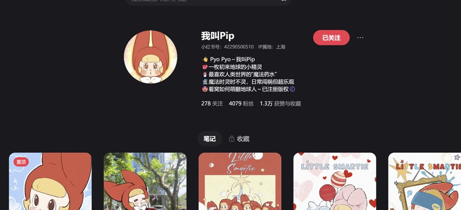
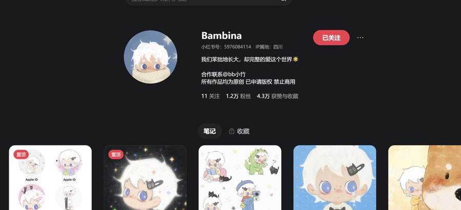
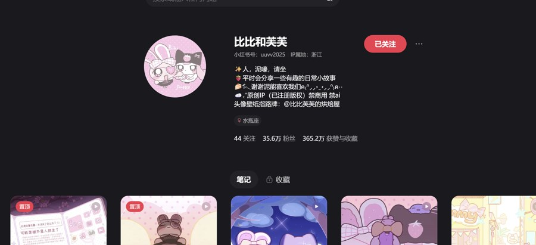
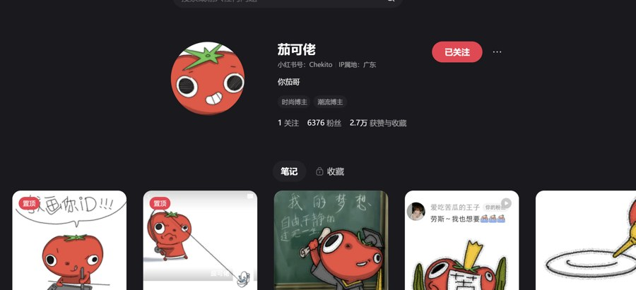

**参考 IP 拆解报告**

竞品研究：同赛道虚拟人物 IP

<table><thead><tr class="header"><th>

我叫 Pip：评论投稿与生活照二创
</th><th>

Bambina：头像壁纸与治愈收藏
</th></tr></thead><tbody><tr class="odd"><td>

比比和芙芙：双角色剧情与世界观
</td><td>

茄可佬：画粉丝 ID 与低成本互动
</td></tr></tbody></table>

## 一、走红原因

这些案例共同证明：虚拟人物 IP 的核心不是“画得可爱”，而是“可被用户持续参与”。比比和芙芙靠双角色关系和连续剧情建立追更感；Bambina靠柔软画风、头像和壁纸形成收藏；我叫 Pip 与茄可佬靠评论区投稿、画粉丝照片/ID，把用户变成内容来源；蒜皮宝宝靠夸张表情和短动画制造高频传播。

## 二、可拆解要素

形象上，它们都有强轮廓：白发蓝眼、红帽小精灵、番茄头、小鸟大眼或粉色双角色，用户一眼能记住。人格上，多数不是完美角色，而是笨拙、黏人、乐观、会犯错，天然适合被评论、安慰和调侃。故事线上，成熟账号会让角色有日常任务、朋友关系、成长线或固定栏目，避免只发单张插画。

## 三、互动钩子

高频钩子包括：可以当头像吗、你发我画、画粉丝 ID、评论区翻牌、壁纸分享、表情包更新、剧情投票和周边期待。封面通常用大头角色、强表情、生活照片叠加角色、九宫格头像、漫画分镜或粉色/治愈背景，降低理解成本。

## 四、我可复用但不照搬的结构

我可以复用“首发建立角色—固定互动栏目—评论区收集素材—用角色回应—沉淀头像/壁纸/表情包—逐步加入故事线”的结构。不要照搬具体形象和画风，而是学习机制：让角色进入用户的评论、头像和生活照片里，形成陪伴感与共创感。

## 五、对我的直接启发

| 方向 | 参考对象         | 落地方式                |
|------|------------------|-------------------------|
| 互动 | 我叫 Pip、茄可佬 | 评论投稿、画照片、画 ID |
| 收藏 | Bambina          | 头像、壁纸、表情包      |
| 留存 | 比比和芙芙       | 角色关系、连续小剧场    |

**结论：我的起步定位应收窄为“会进入粉丝评论、头像和生活照片里的 Q 版 2D 小角色”。**

